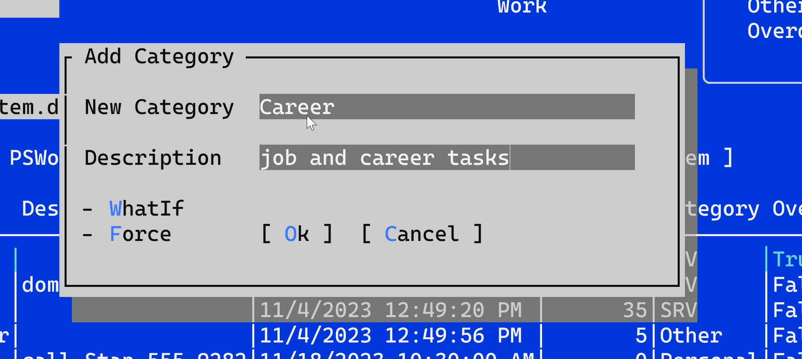
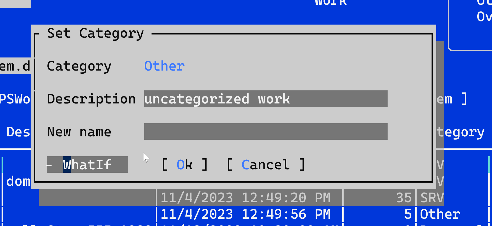
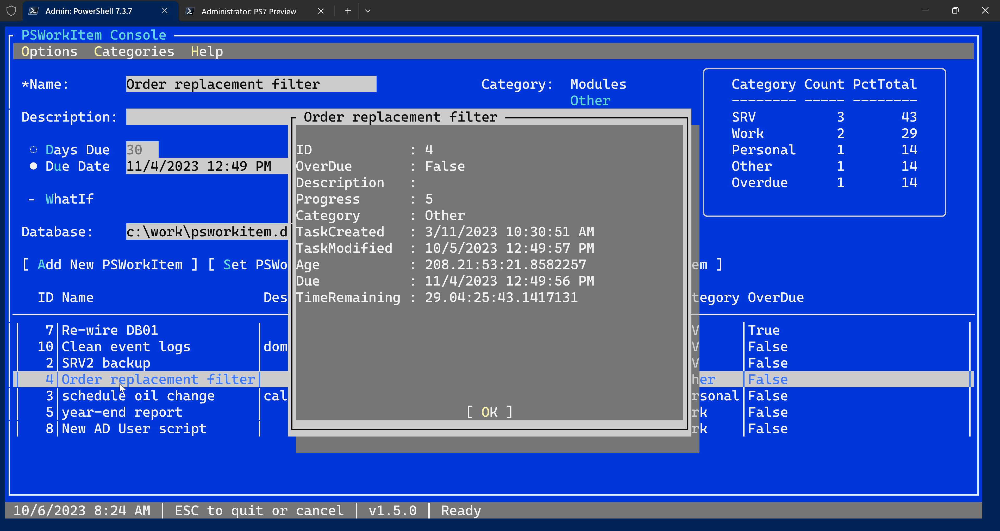

# PSWorkItem

[](https://www.powershellgallery.com/packages/PSWorkItem/) [](https://www.powershellgallery.com/packages/PSWorkItem/)

:information_source:

This module is a replacement for the [MyTasks](https://github.com/jdhitsolutions/MyTasks) module. The original PowerShell module offered simple tasks or to-do management. All data was stored in XML files. This module conceptually is designed the same way but instead uses a SQLite database file. The module commands are wrapped around functions from the [MySQLite](https://github.com/jdhitsolutions/MySQLite) module.

## Installation

This module requires __PowerShell 7.3 or later__ and a 64-bit version of PowerShell, which I assume most people are running. __The module requires a Windows or Linux platform__ until the dependency SQLite module [supports other non-Windows systems](https://github.com/jdhitsolutions/MySQLite/issues/21).

Install the PSWorkItem module from the PowerShell Gallery.

```powershell
Install-Module PSWorkItem [-scope CurrentUser]
```

:heavy_exclamation_mark: Module installation will also install the required [MySQLite](https://github.com/jdhitsolutions/MySQLite) module from the PowerShell Gallery. Linux support was added in `MySQLite v0.13.0`.

After installation, you can run `Open-PSWorkItemHelp` to open a PDF version of this README file. :tipping_hand_person:

## Module Commands and Design

- [Add-PSWorkItemCategory](docs/Add-PSWorkItemCategory.md)
- [Complete-PSWorkItem](docs/Complete-PSWorkItem.md)
- [Get-PSWorkItem](docs/Get-PSWorkItem.md)
- [Get-PSWorkItemArchive](docs/Get-PSWorkItemArchive.md)
- [Get-PSWorkItemCategory](docs/Get-PSWorkItemCategory.md)
- [Get-PSWorkItemData](docs/Get-PSWorkItemData.md)
- [Get-PSWorkItemDatabase](docs/Get-PSWorkItemDatabase.md)
- [Get-PSWorkItemPreference](docs/Get-PSWorkItemPreference.md)
- [Get-PSWorkItemReport](docs/Get-PSWorkItemReport.md)
- [Initialize-PSWorkItemDatabase](docs/Initialize-PSWorkItemDatabase.md)
- [New-PSWorkItem](docs/New-PSWorkItem.md)
- [Open-PSWorkItemConsole](docs/Open-PSWorkItemConsole.md)
- [Open-PSWorkItemHelp](docs/Open-PSWorkItemHelp.md)
- [Remove-PSWorkItem](docs/Remove-PSWorkItem.md)
- [Remove-PSWorkItemArchive](docs/Remove-PSWorkItemArchive.md)
- [Remove-PSWorkItemCategory](docs/Remove-PSWorkItemCategory.md)
- [Set-PSWorkItem](docs/Set-PSWorkItem.md)
- [Set-PSWorkItemCategory](docs/Set-PSWorkItemCategory.md)
- [Update-PSWorkItemDatabase](docs/Update-PSWorkItemDatabase.md)
- [Update-PSWorkItemPreference](docs/Update-PSWorkItemPreference.md)

The module is based on three tables in a SQLite database file. The primary `Tasks` table is where active items are stored.

```text
ColumnIndex ColumnName   ColumnType
----------- ----------   ----------
0           taskid       text
1           taskcreated  text
2           taskmodified text
3           name         text
4           description  text
5           duedate      text
6           category     text
7           progress     integer
8           completed    integer
```

When items are queried from this table using `Get-PSWorkItem` they are written to the pipeline as `PSWorkItem` objects. This is a class-based object defined in the root module.

```powershell
class PSWorkItemBase {
    [int]$ID
    [String]$Name
    [String]$Category
    [String]$Description
    [DateTime]$TaskCreated = (Get-Date)
    [DateTime]$TaskModified = (Get-Date)
    [boolean]$Completed
    [String]$Path
    #this will be last resort GUID to ensure uniqueness
    hidden[guid]$TaskID = (New-Guid).Guid

}
class PSWorkItem:PSWorkItemBase {
    [DateTime]$DueDate = (Get-Date).AddDays(30)
    [int]$Progress = 0

    PSWorkItem ([String]$Name, [String]$Category) {
        $this.Name = $Name
        $this.Category = $Category
    }
    PSWorkItem() {
        $this
    }
}

Class PSWorkItemArchive:PSWorkItemBase {
    [DateTime]$DueDate
    [int]$Progress
}
```

> *These definitions were revised for v1.0.0. of this module.*

Each task or `PSWorkItem` must have an associated category. These are stored in the `Categories` table.

```text
ColumnIndex ColumnName  ColumnType
----------- ----------  ----------
0           category    text
1           description text
```

You __must__ define categories with `Add-PSWorkItemCategory` before you can create a new task. Categories are written to the pipeline as `PSWorkItemCategory` objects, also defined with a PowerShell class.

```powershell
class PSWorkItemCategory {
    [String]$Category
    [String]$Description

    PSWorkItemCategory([String]$Category, [String]$Description) {
        $this.Category = $Category
        $this.Description = $Description
    }
}
```

When a task is complete, you can use `Complete-PSWorkItem` to update the task as completed. This command will copy the task to the `Archive` table, which has the same layout as the `Tasks` table, and then delete it from `Tasks`.

### PSWorkItemPath

The module defines a global variable, `$PSWorkItemPath`, which points to the database file. The default file is `$HOME\PSWorkItem.db`. This variable is used as the default `Path` parameter on all module commands. If you want to change it, do so in your PowerShell profile.

Because everything is stored in a single database file, advanced users could set up multiple PSWorkItem systems. It is up to the user to keep track of database paths.

## Creating a New Database

To get started, run `Initialize-PSWorkItemDatabase`. This will create a new database file and set default categories of Work, Personal, Project, and Other. By default, the new database will be created using the value of `$PSWorkItemPath`.

You can view a database summary with `Get-PSWorkItemDatabase`.

```dos
PS C:\> Get-PSWorkItemDatabase

   Path: C:\Users\Jeff\PSWorkItem.db [44KB]

Created              LastModified         Tasks Archived Categories
-------              ------------         ----- -------- ----------
7/30/2023 1:55:02 PM 9/12/2023 1:05:26 PM    13       35         12
```

## Categories

To add a new category, you must specify a category name. The description is optional. The category will be defined exactly as you enter it, so watch casing.

```powershell
Add-PSWorkItemCategory -Category "SRV" -Description "server management tasks"
```

Use `Get-PSWorkItemCategory` to view your categories.

```dos
PS C:\> Get-PSWorkItemCategory

Category Description
-------- -----------
Work
Personal
Project
Other
Blog     blog management and content
SRV      server management tasks
```

If you need to update a category, you can re-add it using `-Force`.

> The category name is case-sensitive.

```dos
PS C:\> Add-PSWorkItemCategory -Category Work -Description "business-related tasks" `
 -PassThru -Force

Category Description
-------- -----------
Work     business-related tasks
```

Or you can use `Remove-PSWorkItemCategory` and start all over.

Commands that have a `Category` parameter should have tab completion.

## Adding a Task

Use `New-PSWorkItem` to define a task. You need to specify a name and category. You must specify a valid, pre-defined category. By default, the task will be configured with a due date of 30 days from now. You can specify a different datetime or specify the number of days from now.

```powershell
New-PSWorkItem -Name "Publish PSWorkItem" -DaysDue 3 -Category Project
```

Because you have to specify a task, you might want to set a default category.

```powershell
$PSDefaultParameterValues.Add("New-PSWorkItem:Category","Work")
```

## Viewing Tasks

The primary command in this module, `Get-PSWorkItem`, which has an alias of `gwi`, has several parameter sets to help you select PSWorkItems.

- `Get-PSWorkItem [-All] [-Path <String>]`
- `Get-PSWorkItem [-Category <String>] [-Path <String>]`
- `Get-PSWorkItem [-DaysDue <Int32>] [-Path <String>]`
- `Get-PSWorkItem [-ID <String>] [-Path <String>]`
- `Get-PSWorkItem [[-Name] <String>] [-Path <String>]`

The default behavior is to get tasks due within the next ten days


If you are running the command in the PowerShell console or VSCode, overdue tasks will be highlighted in red. Tasks due within three days will be highlighted in yellow.

Read the examples for [Get-PSWorkItem](docs/Get-PSWorkItem.md) for other ways to use this command, including custom format views.

### PSWorkItemCategory

In addition to formatting overdue and imminent due dates, the module also provides a mechanism to add highlighting for specific categories. Importing the module will create a global variable called `PSWorkItemCategory`. The key will be a category name. The value will be a $PSStyle or ANSI escape sequence. These are the module defaults.

```powershell
$global:PSWorkItemCategory = @{
    "Work"     = $PSStyle.Foreground.Cyan
    "Personal" = $PSStyle.Foreground.Green
}
```

You can modify this hashtable as you would any other hashtable.

```powershell
$PSWorkItemCategory.Add("Event","`e[38;5;153m")
```

The entry will have no effect unless the category is defined in the database. The category customizations last for the duration of your PowerShell session or until the module is removed. Add your customizations to your PowerShell profile script or use `Update-PSWorkItemPreference` to save the settings to a JSON file under $HOME.

> Note that when you view the hashtable, you won't see any values because the escape sequences are non-printable.


Category highlighting is only available in the default view.

## Updating Tasks

Use [Set-PSWorkItem](docs/Set-PSWorkItem.md) or its alias `swi` to update a task based on its ID.

```dos
PS C:\> Set-PSWorkItem -id 7 -Progress 30 -DueDate "8/15/2023 12:00PM" -PassThru

  Database: C:\Users\Jeff\PSWorkItem.db

ID Name            Description DueDate               Category Pct
-- ----            ----------- -------               -------- ---
 7 password report             8/15/2023 12:00:00 PM Work      30
```

## Completing Tasks

When a task is complete, you can move it to the `Archive` table.

```dos
PS C:\> Complete-PSWorkItem -id 7 -PassThru

    Database: C:\Users\Jeff\PSWorkItem.db
ID Name          Description Category Completed
-- ----          ----------- -------- ---------
7  update resume             Work     3/11/2023 1:29:08 PM
```

There are no commands to modify the task after it has been archived, so if you want to update the name, description, or category, do so before marking it as complete.

[Complete-PSWorkItem](docs/Complete-PSWorkItem.md) has an alias of `cwi`.

### Removing a Task

If you want to delete a task, you can use [Remove-PSWorkItem](docs/Remove-PSWorkItem.md) or its alias `rwi`.

```powershell
Remove-PSWorkItem -id 13
```

This command will delete the item from the Tasks database.

Beginning with v1.0.0, you can use [Remove-PSWorkItemArchive](docs/Remove-PSWorkItemArchive.md) to remove items from the archive table.

## Reporting

You can use [Get-PSWorkItemReport](docs/Get-PSWorkItemReport.md) to get a summary report of open work items grouped by category.

```dos
PS C:\>  Get-PSWorkItemReport

   Path: C:\Users\Jeff\PSWorkItem.db

Category Count PctTotal
-------- ----- --------
Personal     5       38
Event        3       23
Project      2       15
Work         1        8
Other        1        8
Blog         1        8
Overdue      4       31
```

The percentages for each category are rounded. The percentage for Overdue items is based on all open work items.

## TUI-Based Management Console

Version 1.3.0 added a management console based on the [Terminal.Gui](https://github.com/gui-cs/Terminal.Gui) framework.


Run [`Open-PSWorkItemConsole`](docs\Open-PSWorkItemConsole.md) or its alias *`wic`*. The form will open with your default database. You can type a new database path or use the Open Database command under Options. The file must end in `.db`. If you select a different database, you can use `Options - Reset Form` to reset to your default database.

If you select an item from the table, it will populate the form fields. You can then update, complete, or remove the item. To create a new item, it is recommended that you first clear the form (`Options - Clear Form`). Enter the PSWorkItem details and click the `Add PSWorkItem` button.

You can also manage categories.





You can right-click a task in the table to get detailed information.



__IMPORTANT__ *This command relies on a specific version of the Terminal.Gui assembly. You might encounter version conflicts from modules that use older versions of this assembly like `Microsoft.PowerShell.ConsoleGuiTools`. You may need to load this module first in a new PowerShell session.*

## User Preferences

The module includes features for the user to save preferences. You might update ANSI sequences for some categories using `$PSWorkItemCategory`. You might have set a different default database path using `$PSWorkItemPath`. Or you might have specified a different value for the number of default days with `$PSWorkItemDefaultDays`. Instead of setting these values in your PowerShell profile, you can export them to a JSON file.

```powershell
Update-PSWorkItemPreference
```

This will create a JSON file in `$HOME` called `.psworkitempref.json`. The settings in this file will be used when importing the module.

You can also specify a default category for `New-PSWorkItem`.

```powershell
Update-PSWorkItemPreference -DefaultCategory Work
```

The next time you import the module, an entry will be made to $PSDefaultParameterValues.

```powershell
$global:PSDefaultParameterValues["New-PSWorkItem:Category"] = $importPref.DefaultCategory
```

Use `Get-PSWorkItemPreference` to view.

```dos
PS C:\> Get-PSWorkItemPreference

   Path: C:\Users\Jeff\PSWorkItem.db [Default Days: 7 Default Category: Work]

Category    ANSIString
--------    ----------
Other       `e[38;5;204m
Project     `e[38;5;215m
Event       `e[38;5;153m
Training    `e[94m
Work        `e[36m
Personal    `e[32m
```

The categories are only those where you have customized an ANSI sequence. On module import, these categories will be used to populate `$PSWorkItemCategory.` If you make any changes to your preference, re-run `Update-PSWorkItemPreference`.

> You might need to manually delete the JSON preferences file if you uninstall the module.

## Database Backup

This module has no specific commands for backing up or restoring a database file. But you can use the `Export-MySQLiteDB` command to export the PSWorkItem database file to a JSON file.

```powershell
Export-MySQLiteDB -path $PSWorkItemPath -Destination d:\backups\pwi.json
```

Use `Import-MySQLiteDB` to import the file and rebuild the database file. When restoring a database file, you should restore the file to a new location, verify the database, and then copy the file to `$PSWorkItemPath`.

## Database Sample

A sample database has been created in the module's Samples directory. You can specify the path to the sample database or copy it to `$PSWorkItemPath` to try the module out. Note that it is very likely that many of the tasks will be flagged as overdue by the time you view the database.

If you copy the sample to `$PSWorkItemPath`, delete the file before creating your database file.

## Reminders and Alerts

I have received requests and questions about integrating a reminder or alert system. This module does not have any built-in features for this. You could use a scheduled task or a PowerShell script to query the database for tasks due within a certain time frame and then send an email or other alert. I am reluctant to include this feature because I have no way of knowing how __you__ would want to be alerted or what kind of alert you would want. That said, here are some ways you could implement this feature.

### Send-MailKitMessage

I've started using [Send-MailKitMessage](https://github.com/austineric/Send-MailKitMessage) as a replacement for `Send-MailMessage` I use a script to send myself a daily email.

```powershell
#requires -version 7.2
#requires -module PSWorkItem,Send-MailKitMessage

Param([int]$Days = 5, [switch]$AsText)

#parameters to splat to Send-MailKitMessage
$hash = @{
    Credential    = $global:MailCredential
    From          = 'jhicks@jdhitsolutions.com'
    RecipientList = 'jhicks@jdhitsolutions.com'
    SMTPServer    = $global:SMTPServer
    Port          = $global:SMTPPort
    Subject       = "PSWorkItems Due in the Next $days Days"
    ErrorAction   = 'Stop'
}
Write-Host "[$((Get-Date).ToString())] Getting tasks for the next $days days." -Fore Green
$data = Get-PSWorkItem -DaysDue $Days
if ($data) {

    if ($AsText) {
        Write-Host "[$((Get-Date).ToString())] Sending as TEXT" -Fore Green
        # 10/14/2020 Modified to explicitly select properties because
        # default formatting uses ANSI which distorts the converted output.
        $body = $data | Select-Object -Property ID, Name, Description, DueDate,
        OverDue | Format-Table | Out-String
        $hash.Add('TextBody', $body)
    }

    else {
        Write-Host "[$((Get-Date).ToString())] Sending as HTML" -Fore green
        #css to be embedded in the html document
        $head = @"
    <Title>PSWorkItems Due in $Days Days</Title>
    <style>
    body {
        font-family:Tahoma;
        font-size:12pt; }
    td, th { border:1px solid black;
        border-collapse:collapse; }
    th { color:white;
        background-color:black; }
    table, tr, td, th { padding: 2px; margin: 0px }
    tr:nth-child(odd) { background-color: LightGray }
    table { width:95%; margin-left:5px; margin-bottom:20px; }
    .alert { color: #bd2525 ;}
        .warn { color:#dd510b; }
        </style>
        <br>
        <H1>PSWorkItems</H1>
"@
        [xml]$html = $data |
        Select-Object ID, Name, Description, DueDate, Category, Progress, TimeRemaining |
        ConvertTo-Html -Fragment

        #parse html to add color attributes
        for ($i = 1; $i -le $html.table.tr.count - 1; $i++) {
            $class = $html.CreateAttribute('class')
            #check the number of days until the task is due
            $due = $html.table.tr[$i].td[-1] -as [TimeSpan]
            if ($due.Days -le 1) {
                $class.value = 'alert'
                [void]($html.table.tr[$i].Attributes.Append($class))
            }
            elseif ($due.Days -le 2) {
                $class.value = 'warn'
                [void]($html.table.tr[$i].Attributes.Append($class))
            }
        }

        $Body = ConvertTo-Html -Body $html.InnerXml -Head $head | Out-String
        $hash.Add('HTMLBody', $body)
    }
}
else {
    Write-Warning "No tasks found due in the next $days days."
    #bail out
    return
}

Try {
    Send-MailKitMessage @hash
    $msg = "Message {0} sent to {1} from {2}" -f $hash.subject,$hash.RecipientList,$hash.from
    Write-Output "[$((Get-Date).ToString())] $msg"
}
Catch {
    throw $_
}
```

Because the PSWorkItem module requires PowerShell 7 and PowerShell 7 doesn't support scheduled jobs, I set up a scheduled task to run this script daily.

```powershell
$actionArg = '-nologo -noprofile -file C:\scripts\DailyPSWorkItemEmail.ps1'
$action = New-ScheduledTaskAction -Execute 'pwsh.exe' -argument $actionArg
$trigger = New-ScheduledTaskTrigger -Daily -At 7:30AM
$options = new-ScheduledTaskSettingsSet -RunOnlyIfNetworkAvailable

$paramHash = @{
    Force       = $True
    User        = "Jeff"
    Password    = Read-Host "Enter the user password"
    RunLevel    = "highest"
    TaskName    = "DailyWorkItem"
    TaskPath    = "\Microsoft\Windows\PowerShellCore\ScheduledJobs\"
    Description = "Send PSWorkItem email"
    Settings    = $options
    Trigger     = $trigger
    Action      = $action
}

Register-ScheduledTask @paramHash
```

I get an HTML-formatted email every morning with tasks due in the next 5 days.

### Toast Notifications

Another option would be to create something with the excellent [BurntToast](https://github.com/Windos/BurntToast) module.

### New-PwshToastAlarm

I use a function in PowerShell 7 to create a toast notification using a PowerShell scheduled job in Windows Powershell.

```powershell
Function New-PwshToastAlarm {

    [cmdletbinding(DefaultParameterSetName = "sound", SupportsShouldProcess)]
    [alias("nta")]
    [OutputType("PSScheduledJob")]
    Param(
        [Parameter(
            Position = 0,
            Mandatory,
            ValueFromPipelineByPropertyName,
            HelpMessage = "What date and time do you want to use for the reminder?"
        )]
        [ValidateNotNullOrEmpty()]
        [Alias("Date", "Time")]
        [DateTime]$At,

        [Parameter(
            Mandatory,
            ValueFromPipelineByPropertyName,
            HelpMessage = "What message do you want to display?"
        )]
        [Alias("Event", "Message")]
        [ValidateNotNullOrEmpty()]
        [string]$Text,

        [Parameter(HelpMessage = "Specify the path to an image file to use as logo")]
        [alias("logo")]
        [string]$AppLogo = "$env:OneDriveConsumer\pictures\psrobot-icon.png",

        [Parameter(HelpMessage = "What sound would you like?", ParameterSetName = "sound")]
        [ValidateSet('Default', 'IM', 'Mail', 'Reminder', 'SMS', 'Alarm', 'Alarm2', 'Alarm3',
         'Alarm4','Alarm5', 'Alarm6', 'Alarm7', 'Alarm8', 'Alarm9', 'Alarm10', 'Call',
         'Call2', 'Call3', 'Call4', 'Call5','Call6', 'Call7', 'Call8', 'Call9', 'Call10',
         'None')]
        [string]$Sound = "Default",

        [Parameter(HelpMessage = "Create a silent alert", ParameterSetName = "silent")]
        [switch]$Silent,

        [Parameter(HelpMessage = "Specify a job name")]
        [string]$Name = "BTReminder-$(Get-Random -Minimum 1000 -Maximum 9999)"
    )

    Begin {
        Write-Verbose "[$((Get-Date).TimeOfDay) BEGIN  ] Starting $($MyInvocation.MyCommand)"
    } #begin
    Process {
        Write-Verbose "[$((Get-Date).TimeOfDay) PROCESS] Defining a toast job for $At - $Text"
        $h = @{
            Text  = $Text
            At    = $At
            Sound = $sound
            Name  = $Name
        }

        if ($AppLogo) {
            $h.add("AppLogo", $AppLogo)
        }
        $cmd = [System.Collections.Generic.list[string]]::new()
        $alarms = [System.Collections.Generic.list[string]]::new()

        $cmd.add("&{ . c:\scripts\New-ToastAlarm.ps1 ; ")
        $alarms.Add("New-ToastAlarm ")

        $h.GetEnumerator() | ForEach-Object {
            $alarms.Add("-$($_.key) '$($_.value)' ")
        }

        $a = $alarms -join ''
        $cmd.Add("$a}")

        Write-Verbose "[$((Get-Date).TimeOfDay) PROCESS] Invoking: $cmd"
        if ($PSCmdlet.ShouldProcess($a)) {
            powershell -NoLogo -NoProfile -command $cmd
        }
    }
    End {
        Write-Verbose "[$((Get-Date).TimeOfDay) END    ] Ending $($MyInvocation.MyCommand)"
    } #end

} #close function
```

This function calls another script that creates the toast notification as a scheduled job in Windows PowerShell.

```powershell
#requires -version 5.1
#requires -module BurntToast,PSScheduledJob

#New-ToastAlarm.ps1

Function New-BTReminder {
    [cmdletbinding(DefaultParameterSetName = 'sound', SupportsShouldProcess)]
    [alias('nta', 'New-ToastAlarm')]
    param(
        [Parameter(
            Position = 0,
            Mandatory,
            HelpMessage = 'What date and time do you want to use for the reminder?'
        )]
        [ValidateNotNullOrEmpty()]
        [DateTime]$At,
        [Parameter(Mandatory, HelpMessage = 'What message do you want to display?')]
        [ValidateNotNullOrEmpty()]
        [string]$Text,
        [Parameter(HelpMessage = 'Specify the path to an image file to use as logo')]
        [alias('Logo')]
        [string]$AppLogo,
        [Parameter(HelpMessage = 'What sound would you like?', ParameterSetName = 'sound')]
        [ValidateSet('Default', 'IM', 'Mail', 'Reminder', 'SMS', 'Alarm', 'Alarm2',
        'Alarm3', 'Alarm4','Alarm5', 'Alarm6', 'Alarm7', 'Alarm8', 'Alarm9', 'Alarm10',
        'Call', 'Call2', 'Call3', 'Call4', 'Call5','Call6', 'Call7', 'Call8', 'Call9',
        'Call10', 'None'
        )]
        [string]$Sound,
        [Parameter(HelpMessage = 'Create a silent alert', ParameterSetName = 'silent')]
        [switch]$Silent,
        [Parameter(HelpMessage = 'Specify a job name')]
        [string]$Name = "BTReminder-$(Get-Random -Minimum 1000 -Maximum 9999))"
    )

    Write-Verbose "Starting $($MyInvocation.MyCommand)"
    Write-Verbose "Running in PowerShell $($PSVersionTable.PSVersion)"
    $PSBoundParameters | Out-String | Write-Verbose

    [void]($PSBoundParameters.remove('At'))
    [void]($PSBoundParameters.remove('Name'))

    $toastParams = @{}

    $PSBoundParameters.GetEnumerator() | ForEach-Object {
        Write-Verbose "Adding $($_.key) to `$toastParams"
        $toastParams.Add($_.key, $_.value)
    }
    #add a toast expiration
    $toastParams.Add('Expiration', $At.AddMinutes(5))
    $toastParams.Add('SnoozeAndDismiss', $True)
    $sb = {
        param([hashtable]$Params, [string]$JobName)
            #The Write-Host output will only show if you receive the job.
            #Use for troubleshooting.
            Write-Host 'Defining a toast job using these params' -ForegroundColor Green
            $params | Out-String | Write-Host
            Write-Host 'Toasting...' -ForegroundColor Green
            New-BurntToastNotification @params
            Write-Host Sleeping -ForegroundColor Green
            Start-Sleep -Seconds 60
            Write-Host "attempting to unregister $jobName" -ForegroundColor Green
            Unregister-ScheduledJob -Name $JobName
    }

    $job = @{
        Trigger        = New-JobTrigger -At $At -Once
        Name           = $Name
        MaxResultCount = 1
        ScriptBlock    = $sb
        ArgumentList   = @($toastParams, $Name)
    }

    Write-Verbose 'Using toast params'
    $toastParams | Out-String | Write-Verbose

    Write-Verbose 'Registering job'
    $job | Out-String | Write-Verbose

    Register-ScheduledJob @job

    Write-Verbose "Ending $($MyInvocation.MyCommand)"
}
```

Now it is a matter of deciding when you want to be notified.

```powershell
Get-PSWorkItem | where { -Not $_.OverDue } |
ForEach-Object -Begin {
    . C:\scripts\New-PwshToastAlarm.ps1
} -Process {
    $splat = @{
        At   = ([datetime]$_.dueDate).addDays(-1)
        Text = "WorkItem $($_.Name) is due $($_.DueDate)"
    }
    New-PwshToastAlarm $splat
}
```

This is why I am hesitant to add any form of alerting or notification. I don't know what is the most effective way for __you__ to be alerted. And, any alerting feature I add would more than likely add a dependency on a specific module which I want to avoid.

If you have a solution you would like to share, please feel free to post it in the repository's [Discussion section](https://github.com/jdhitsolutions/PSWorkItem/discussions).

## PSWorkItem Database Change

**If you were using a version of this module older than v1.0.0, this note applies to you.**

> *Version 1.0.0 of the PSWorkItem module introduced a structural change to the database tables. If you are using a database created in an earlier version, you need to run [Update-PSWorkItemDatabase](docs/Update-PSWorkItemDatabase.md) before adding, changing, or completing work items. You should back up your database file before running this command.
> Alternatively, you could export your work items, delete the database file, initialize a new one, and re-import your work items.
>During the upgrade, a new table column called ID is added to the Tasks and Archive database tables. In the Tasks table, the ID column for existing entries will be set to the row id, which should be the task number you are used to seeing. In the archive table, existing entries will get an ID value of 0 since knowing the original ID number is impossible. This database change corrects this problem. Going forward, the PSWorkItem ID will remain the same when you complete it and move the item to the Archive table.*

## Troubleshooting

Most of the commands in this module create custom objects derived from PowerShell [class definitions](PSWorkItem.psm1) and data in the SQLite database file. If you need to troubleshoot a problem, you can use `Get-PSWorkItemData` to select all data from one of the three tables.

```dos
PS C:\> Get-PSWorkItemData

taskid       : 2196617b-b818-415d-b9cc-52b0c649a77e
taskcreated  : 07/28/2023 16:56:25
taskmodified : 07/30/2023 14:01:09
name         : Update PSWorkItem module
description  : v0.6.0
duedate      : 12/31/2023 12:00:00
category     : Other
progress     : 10
completed    : 0
rowid        : 19
...
```

## :octocat: Future Tasks or Commands

- Password protection options.

If you have an enhancement suggestion, please [submit it as an Issue](https://github.com/jdhitsolutions/PSWorkItem/issues).
